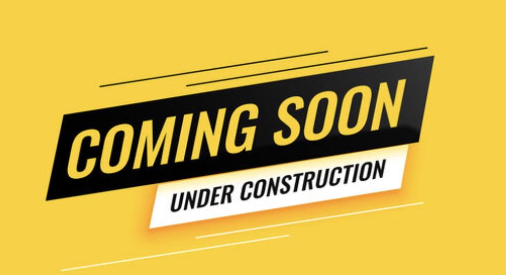

# Kailee's Portfolio
Module 2, Advanced CSS Challenge - Professional Portfolio

**Author**: Kailee Segarra

**Date last updated**: 07/12/2024

Welcome to my professional portfolio! This site showcases my projects and skills as a Full-Stack Developer. It's designed to give you a comprehensive look at my capabilities through various projects I've completed so far

## Table of Contents

- [Introduction](#introduction)
- [Technologies Used](#technologies-used)
- [Features](#features)
- [Screenshots](#screenshots)
- [Setup](#setup)
- [Usage](#usage)
- [Project Status](#project-status)
- [Room for Improvement](#room-for-improvement)
- [Acknowledgements](#acknowledgements)
- [Contact](#contact)

## Introduction

This portfolio is intended to provide potential employers and collaborators insight into my skills in web development. From front-end design to back-end logic, the portfolio includes various projects demonstrating my capabilities.

## Technologies Used

- HTML
- CSS
- JavaScript

## Features

List the ready features here:
- Interactive, responsive design
- Navigation bar that allows the user to jump to different sections of the portfolio
- Gallery of projects with images and links to live sites
- Contact form for easy communication

## Screenshots

## Setup

$ cd ../path/to/the/file

$ npm install

$ npm start

## Usage

How to use your project? 
- Visit [Kailee's Portfolio](https://kaileesegarra.github.io/portfolio/) to view the live site.
- Navigate through the sections to explore different projects.
- Click on project thumbnails for detailed information and links to live sites.

## Project Status

Project is: _in progress_

## Room for Improvement

Include areas you believe need improvement / could be developed further. For example:
- Update "Work" section
- Enhancements in UI/UX
- Responsive tweaks for mobile + desktop devices

## Acknowledgements

- This project was inspired by [Project Inspirer's Name](Project URL).

## Contact

Created by [Kailee](https://github.com/kaileesegarra/) - Connect with me!